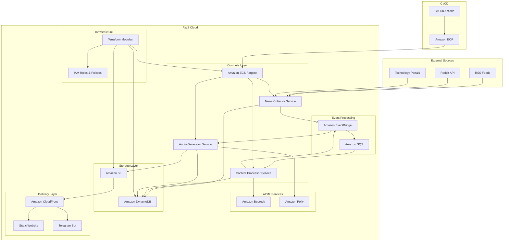

# Design Document: Smart News Radio System

## Overview

The Smart News Radio system is a cloud-native, event-driven platform that automates the end-to-end process of collecting, processing, and delivering news content as audio. The architecture emphasizes infrastructure-as-code, managed services, and loose coupling to ensure scalability, maintainability, and long-term compatibility.

The system follows a microservices architecture pattern where each component has a single responsibility and communicates through well-defined interfaces. This design enables independent scaling, deployment, and evolution of components while maintaining system reliability.

### Key Design Principles

1. **Infrastructure-First**: All resources defined and managed through Terraform
2. **Event-Driven Architecture**: Asynchronous communication between components
3. **Loose Coupling**: Minimal dependencies between services
4. **Managed Services**: Leverage AWS managed services to reduce operational overhead
5. **Security by Design**: Least-privilege access and encryption throughout
6. **Incremental Deployment**: Components can be deployed and tested independently

## Architecture

The system consists of several loosely coupled components that communicate through events and message queues. The architecture follows the producer-consumer pattern where each stage produces events that trigger the next stage in the pipeline.



### Event Flow Architecture

The system operates on an event-driven model where each component publishes events upon completion of its tasks:

1. **Collection Events**: Triggered by scheduled tasks, result in content collection
2. **Processing Events**: Triggered by new content availability, result in summarization
3. **Audio Generation Events**: Triggered by processed content, result in audio files
4. **Delivery Events**: Triggered by new audio availability, update delivery channels

## Components and Interfaces

### News Collector Service

**Responsibility**: Collect news content from external sources and store raw data

**Technology Stack**:
- Runtime: ECS Fargate container
- Scheduling: Amazon EventBridge (cron expressions)
- Storage: Amazon DynamoDB for metadata, Amazon S3 for raw content
- Event Publishing: Amazon EventBridge

**Key Interfaces**:
```typescript
interface NewsCollectorService {
  collectFromRSS(feedUrls: string[]): Promise<CollectionResult>
  collectFromReddit(subreddits: string[]): Promise<CollectionResult>
  collectFromTechPortals(portalConfigs: PortalConfig[]): Promise<CollectionResult>
  publishCollectionEvent(result: CollectionResult): Promise<void>
}

interface CollectionResult {
  itemsCollected: number
  itemsSkipped: number
  errors: CollectionError[]
  contentIds: string[]
}
```

**Configuration**:
- Source configurations stored in DynamoDB
- Retry policies for failed collections
- Duplicate detection based on content hashing

### Content Processor Service

**Responsibility**: Summarize collected content using LLM services

**Technology Stack**:
- Runtime: ECS Fargate container
- AI Service: Amazon Bedrock (Claude/Titan models)
- Event Consumption: Amazon SQS
- Storage: Amazon DynamoDB for processed content metadata

**Key Interfaces**:
```typescript
interface ContentProcessorService {
  processContent(contentId: string): Promise<ProcessingResult>
  summarizeWithLLM(content: string): Promise<string>
  validateSummary(summary: string): Promise<boolean>
  publishProcessingEvent(result: ProcessingResult): Promise<void>
}

interface ProcessingResult {
  contentId: string
  summary: string
  processingTime: number
  model: string
  status: 'success' | 'failed' | 'retry'
}
```

**Processing Pipeline**:
1. Retrieve raw content from storage
2. Apply content preprocessing (cleaning, formatting)
3. Send to Bedrock for summarization
4. Validate summary quality
5. Store processed content and publish event

### Audio Generator Service

**Responsibility**: Convert text summaries to audio using text-to-speech services

**Technology Stack**:
- Runtime: ECS Fargate container
- TTS Service: Amazon Polly
- Storage: Amazon S3 for audio files
- Event Consumption: Amazon SQS

**Key Interfaces**:
```typescript
interface AudioGeneratorService {
  generateAudio(contentId: string): Promise<AudioResult>
  convertToSpeech(text: string, voice: VoiceConfig): Promise<AudioBuffer>
  uploadAudioFile(audio: AudioBuffer, metadata: AudioMetadata): Promise<string>
  publishAudioEvent(result: AudioResult): Promise<void>
}

interface AudioResult {
  contentId: string
  audioUrl: string
  duration: number
  format: 'mp3' | 'wav'
  voice: string
  status: 'success' | 'failed'
}
```

**Audio Processing**:
- Multiple voice options and languages
- Audio format optimization for web delivery
- Metadata embedding for player applications

### Content Delivery System

**Responsibility**: Serve audio content through web interface and messaging bot

**Technology Stack**:
- Static Hosting: Amazon S3 + CloudFront
- Bot Platform: Telegram Bot API
- Content Management: DynamoDB for content catalog

**Web Interface Features**:
- Responsive design for mobile and desktop
- Audio player with playlist functionality
- Content categorization and search
- RSS feed for podcast applications

**Bot Interface Features**:
- Daily news digest delivery
- On-demand content requests
- User preference management
- Subscription management

### Infrastructure Management

**Responsibility**: Define and manage all cloud resources through code

**Technology Stack**:
- Infrastructure as Code: Terraform
- Module Organization: Environment-specific configurations
- State Management: Terraform Cloud or S3 backend

**Module Structure**:
```
terraform/
├── modules/
│   ├── networking/          # VPC, subnets, security groups
│   ├── compute/            # ECS cluster, task definitions
│   ├── storage/            # S3 buckets, DynamoDB tables
│   ├── messaging/          # EventBridge, SQS queues
│   ├── security/           # IAM roles, policies
│   └── monitoring/         # CloudWatch, alarms
├── environments/
│   ├── dev/
│   ├── staging/
│   └── prod/
└── shared/                 # Common configurations
```

## Data Models

### Content Item Model

```typescript
interface ContentItem {
  id: string                    // UUID
  source: 'rss' | 'reddit' | 'tech_portal'
  sourceUrl: string
  title: string
  originalContent: string
  summary?: string
  audioUrl?: string
  createdAt: Date
  updatedAt: Date
  status: 'collected' | 'processed' | 'audio_generated' | 'published'
  metadata: {
    author?: string
    publishedDate?: Date
    tags: string[]
    category: string
    processingDuration?: number
    audioDuration?: number
  }
}
```

### Processing State Model

```typescript
interface ProcessingState {
  contentId: string
  stage: 'collection' | 'processing' | 'audio_generation' | 'delivery'
  status: 'pending' | 'in_progress' | 'completed' | 'failed'
  attempts: number
  lastAttempt: Date
  nextRetry?: Date
  errorMessage?: string
  processingMetrics: {
    startTime: Date
    endTime?: Date
    duration?: number
    resourcesUsed: Record<string, any>
  }
}
```

### User Preferences Model

```typescript
interface UserPreferences {
  userId: string
  platform: 'web' | 'telegram'
  deliverySchedule: {
    enabled: boolean
    time: string              // HH:MM format
    timezone: string
    frequency: 'daily' | 'weekly'
  }
  contentFilters: {
    categories: string[]
    sources: string[]
    maxDuration?: number      // in minutes
  }
  audioPreferences: {
    voice: string
    speed: number             // 0.5 to 2.0
    format: 'mp3' | 'wav'
  }
}
```

### Configuration Model

```typescript
interface SystemConfiguration {
  sources: {
    rss: RSSSourceConfig[]
    reddit: RedditSourceConfig[]
    techPortals: TechPortalConfig[]
  }
  processing: {
    bedrockModel: string
    maxContentLength: number
    summaryTargetLength: number
    retryPolicy: RetryConfig
  }
  audio: {
    defaultVoice: string
    supportedFormats: string[]
    qualitySettings: AudioQualityConfig
  }
  delivery: {
    webConfig: WebDeliveryConfig
    botConfig: BotDeliveryConfig
  }
}
```

## Correctness Properties

*A property is a characteristic or behavior that should hold true across all valid executions of a system—essentially, a formal statement about what the system should do. Properties serve as the bridge between human-readable specifications and machine-verifiable correctness guarantees.*

### Property 1: Multi-Source Content Collection
*For any* configured news source (RSS, Reddit, or tech portal), when the News_Collector runs on schedule, it should successfully retrieve and store content with proper metadata and error handling for failed sources.
**Validates: Requirements 1.1, 1.2, 1.3, 1.5**

### Property 2: Content Storage Persistence
*For any* collected news content, it should be stored in the data store with complete metadata and be retrievable for subsequent processing stages.
**Validates: Requirements 1.4**

### Property 3: Duplicate Content Prevention
*For any* content that has been previously collected, the system should detect duplicates and prevent reprocessing while maintaining the original content.
**Validates: Requirements 1.6**

### Property 4: LLM Content Processing
*For any* raw news content, the Content_Processor should successfully summarize it using LLM services and validate the output quality before proceeding.
**Validates: Requirements 2.1, 2.2**

### Property 5: Processing Retry with Exponential Backoff
*For any* processing failure, the Content_Processor should retry with exponential backoff until success or maximum attempts are reached.
**Validates: Requirements 2.3**

### Property 6: Content Chunking for Length Limits
*For any* content that exceeds configured length limits, the Content_Processor should appropriately chunk the content while preserving meaning and context.
**Validates: Requirements 2.5**

### Property 7: Text-to-Speech Audio Generation
*For any* summarized text content, the Audio_Generator should convert it to speech using TTS services and store the resulting audio files in multiple formats.
**Validates: Requirements 3.1, 3.4**

### Property 8: Audio Storage with Metadata
*For any* generated audio file, it should be stored in object storage with complete metadata including file locations, duration, and format information.
**Validates: Requirements 3.2, 3.5**

### Property 9: Audio Generation Retry with Parameter Variation
*For any* audio generation failure, the system should retry with different voice parameters before marking the operation as failed.
**Validates: Requirements 3.3**

### Property 10: Multi-Channel Content Delivery
*For any* available audio content, it should be accessible through both the static website and messaging bot interface with proper caching and performance optimization.
**Validates: Requirements 4.1, 4.2, 4.4**

### Property 11: Recent Content Serving
*For any* user request for content, the system should serve the most recent available audio content based on creation timestamp.
**Validates: Requirements 4.3**

### Property 12: Access Pattern Logging
*For any* content request, the system should log access patterns with sufficient detail for analytics and monitoring purposes.
**Validates: Requirements 4.5**

### Property 13: Incremental Infrastructure Changes
*For any* infrastructure modification, Terraform should apply changes incrementally without disrupting existing resources or breaking system functionality.
**Validates: Requirements 5.3**

### Property 14: Resource Tagging for Governance
*For any* cloud resource created by the Infrastructure_Manager, it should be tagged with appropriate metadata for governance, cost tracking, and environment identification.
**Validates: Requirements 5.5**

### Property 15: Least-Privilege IAM Implementation
*For any* IAM role created by the Security_Manager, it should have only the minimal permissions required for its specific function and no additional privileges.
**Validates: Requirements 6.1**

### Property 16: Comprehensive Encryption
*For any* data stored or transmitted by the system, it should be encrypted using appropriate encryption methods (at rest and in transit).
**Validates: Requirements 6.2, 6.3**

### Property 17: Container Security Scanning
*For any* container image deployed to the system, it should be scanned for vulnerabilities before deployment and meet security standards.
**Validates: Requirements 6.4**

### Property 18: Automatic Credential Rotation
*For any* credential that supports automatic rotation, the Security_Manager should rotate it according to the configured policy without service disruption.
**Validates: Requirements 6.5**

### Property 19: State Management with Timestamps
*For any* state change in the system, the State_Manager should persist the change with accurate timestamps and maintain processing status tracking.
**Validates: Requirements 7.1, 7.2, 7.3**

### Property 20: Operational Query Capabilities
*For any* operational monitoring query, the State_Manager should provide accurate and timely responses based on stored metadata and state information.
**Validates: Requirements 7.4**

### Property 21: Detailed Error Logging
*For any* error that occurs in the system, detailed error information should be logged with sufficient context for debugging and operational response.
**Validates: Requirements 7.5**

### Property 22: Event-Driven Workflow Progression
*For any* completed processing stage (collection, summarization, audio generation), the system should publish appropriate events to trigger the next stage in the workflow.
**Validates: Requirements 8.1, 8.2, 8.3**

### Property 23: Asynchronous Message Queue Communication
*For any* inter-component communication, the system should use message queues for asynchronous processing rather than synchronous direct calls.
**Validates: Requirements 8.4**

### Property 24: Graceful Degradation on Component Failure
*For any* component failure, the system should continue operating with degraded functionality rather than complete system failure.
**Validates: Requirements 8.5**

### Property 25: Automated CI/CD Pipeline Execution
*For any* code commit to the main branch, the deployment system should automatically trigger builds, run tests, and deploy to staging in sequence.
**Validates: Requirements 9.1, 9.2, 9.3**

### Property 26: Automatic Rollback on Deployment Failure
*For any* deployment failure, the system should automatically rollback to the previous stable version without manual intervention.
**Validates: Requirements 9.5**

### Property 27: Comprehensive Metrics Collection
*For any* system operation, relevant metrics (processing times, success rates, resource usage) should be collected and made available for monitoring.
**Validates: Requirements 10.1**

### Property 28: Error Alerting System
*For any* system error that meets alerting criteria, appropriate alerts should be sent to operators with sufficient detail for response.
**Validates: Requirements 10.3**

### Property 29: Audit Trail Maintenance
*For any* significant system operation, an audit log entry should be created with complete context and timestamp information.
**Validates: Requirements 10.4**

### Property 30: Distributed Tracing for Complex Workflows
*For any* multi-component workflow execution, distributed tracing data should be available to enable debugging and performance analysis.
**Validates: Requirements 10.5**

## Error Handling

The system implements comprehensive error handling at multiple levels to ensure resilience and reliability:

### Component-Level Error Handling

**News Collector Service**:
- Source-specific error handling with circuit breaker patterns
- Graceful degradation when individual sources fail
- Retry logic with exponential backoff for transient failures
- Dead letter queues for persistent failures

**Content Processor Service**:
- LLM service timeout and rate limiting handling
- Content validation and quality checks
- Fallback processing strategies for edge cases
- Batch processing failure isolation

**Audio Generator Service**:
- TTS service failure recovery with voice parameter variation
- Audio format conversion error handling
- Storage upload retry mechanisms
- Partial failure recovery for batch operations

### System-Level Error Handling

**Event Processing**:
- Message queue dead letter handling
- Event replay capabilities for failed processing
- Poison message detection and isolation
- Cross-service error propagation control

**Infrastructure Resilience**:
- Multi-AZ deployment for high availability
- Auto-scaling based on queue depth and processing metrics
- Health check implementations for all services
- Graceful shutdown procedures for maintenance

**Data Consistency**:
- Eventual consistency handling in distributed operations
- Conflict resolution for concurrent updates
- Data validation at service boundaries
- Backup and recovery procedures for critical data

## Testing Strategy

The testing strategy employs a dual approach combining unit tests for specific scenarios and property-based tests for comprehensive validation:

### Unit Testing Approach

**Focus Areas**:
- Specific integration points between AWS services
- Edge cases in content processing and validation
- Error condition handling and recovery
- Configuration and environment-specific behavior

**Key Test Categories**:
- **Integration Tests**: Verify AWS service integrations work correctly
- **Contract Tests**: Ensure service interfaces remain compatible
- **Security Tests**: Validate IAM permissions and encryption
- **Performance Tests**: Verify system meets latency and throughput requirements

### Property-Based Testing Approach

**Configuration**:
- **Testing Library**: Hypothesis (Python) or fast-check (TypeScript/JavaScript)
- **Minimum Iterations**: 100 per property test
- **Test Tagging**: Each test tagged with **Feature: smart-news-radio, Property {number}: {property_text}**

**Property Test Implementation**:
- Generate random content, configurations, and system states
- Verify universal properties hold across all generated inputs
- Focus on invariants that must be maintained regardless of input
- Test system behavior under various failure scenarios

**Coverage Strategy**:
- **Unit tests**: Handle specific examples, integration points, and error conditions
- **Property tests**: Verify universal correctness properties across all inputs
- **End-to-end tests**: Validate complete workflows in staging environments
- **Chaos engineering**: Test system resilience under various failure modes

**Test Environment Management**:
- Isolated test environments for each test suite
- Infrastructure-as-code for test environment provisioning
- Automated test data generation and cleanup
- Continuous integration with automated test execution

The combination of unit and property-based testing ensures both concrete correctness validation and comprehensive input coverage, providing confidence in system reliability and correctness across all operational scenarios.